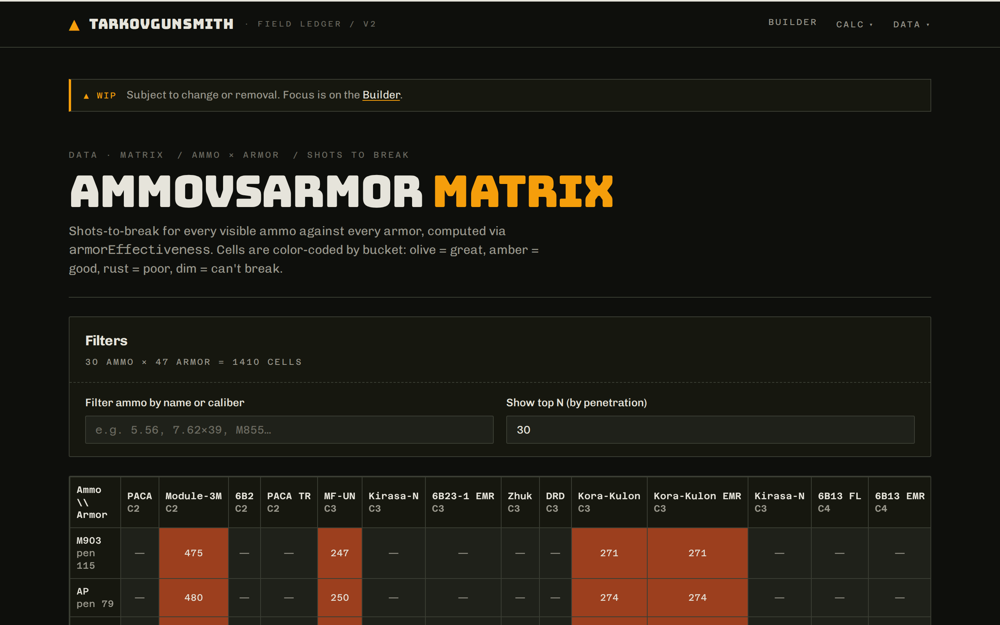

# TarkovGunsmith

**Ballistics calculator, weapon builder, and ammo-vs-armor analysis for Escape from Tarkov.**

[](./LICENSE)
[](https://github.com/UnderMyBed/TarkovGunsmith/actions/workflows/ci.yml)
[](https://github.com/UnderMyBed/TarkovGunsmith/releases)

🔗 **[Try it live →](https://tarkov-gunsmith-web.pages.dev)**



## What it does

- **Ballistics calculator (`/calc`)** — penetration chance, damage after armor, and effective range for any ammo-vs-armor matchup.
- **Weapon builder (`/builder`)** — pick a weapon, attach mods that actually fit its slots, see the stat deltas live.
- **Ammo-vs-armor matrix (`/matrix`)** — scan a whole armor tier in one view, find the breakpoints that matter.
- **Simulator (`/sim`)** — shot-by-shot outcome distributions for a full loadout against a full kit.
- **Share builds** — every build gets a short URL. Send it to your squad. Import on any device.

## Try it

Open **[https://tarkov-gunsmith-web.pages.dev](https://tarkov-gunsmith-web.pages.dev)** — no login, no install.

Looking for a specific workflow? `/builder` is the fastest starting point; pick a weapon and start experimenting.

## Run it locally

```bash
pnpm install
pnpm dev
```

That brings up the SPA at `http://localhost:5173` plus the two Workers (`data-proxy`, `builds-api`). For fresh-clone setup (env files, seeded demo builds), see [`docs/operations/local-development.md`](./docs/operations/local-development.md).

## Contribute

Yes please — bug reports, data corrections, small fixes, new features. Good first issues are tagged [`good first issue`](https://github.com/UnderMyBed/TarkovGunsmith/labels/good%20first%20issue). Full contribution guide: [`CONTRIBUTING.md`](./CONTRIBUTING.md).

## How this project is built

This repo is developed collaboratively with [Claude](https://claude.ai/code), using a spec → plan → TDD → review flow documented in [`CLAUDE.md`](./CLAUDE.md) (the maintainer handbook) and [`docs/ai-workflow/`](./docs/ai-workflow/). Contributors are welcome to use any workflow they prefer — adopting the Claude workflow is never required to submit a PR.

## Acknowledgments

Original [TarkovGunsmith](https://github.com/Xerxes-17/TarkovGunsmith) by [Xerxes-17](https://github.com/Xerxes-17). Game data from [`api.tarkov.dev`](https://api.tarkov.dev) by [`the-hideout`](https://github.com/the-hideout). Full credits: [`ACKNOWLEDGMENTS.md`](./ACKNOWLEDGMENTS.md).

## License

[MIT](./LICENSE). _Escape from Tarkov, the EFT logo, and related marks are trademarks of Battlestate Games Limited. This project is an unofficial, fan-made community tool and is not affiliated with, endorsed by, or sponsored by Battlestate Games._
